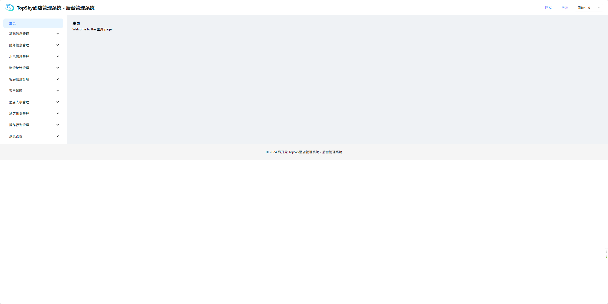
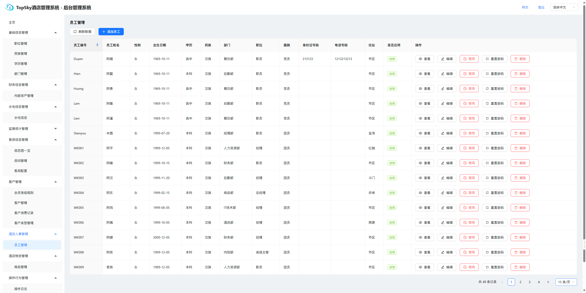
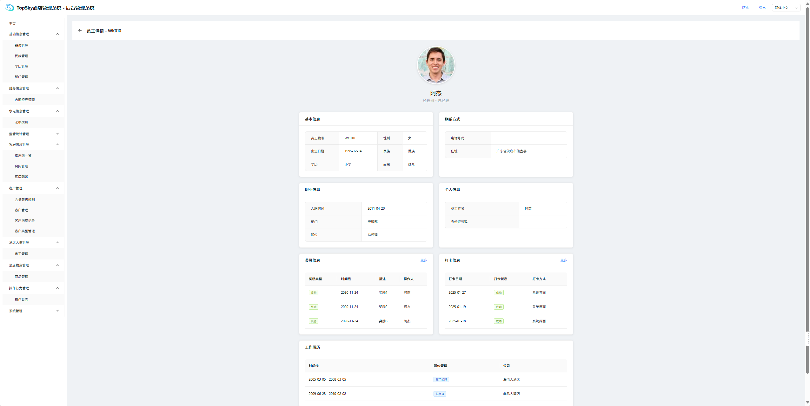
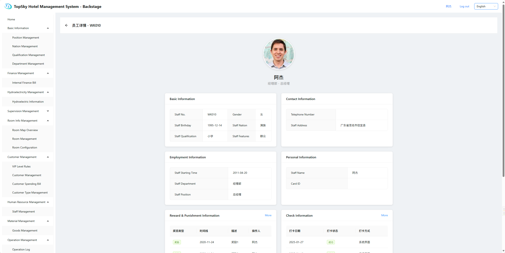
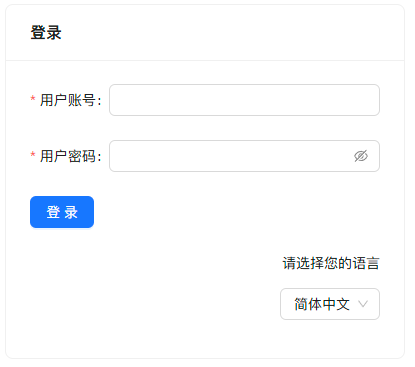
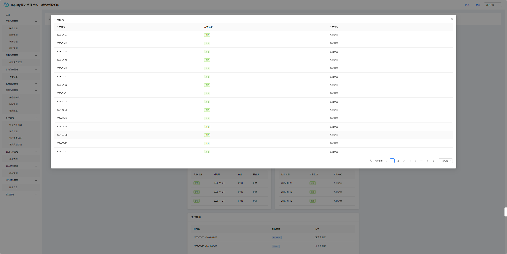

<h1 align="center"></h1>
<h1 align="center">TopskyHotelManagerSystem-Vue3</h1>
<p align="center">
	<a href='https://gitee.com/java-and-net/topsky-hotel-manager-system-vue3/stargazers'></img></a>
        <a href='https://gitee.com/java-and-net/topsky-hotel-manager-system-vue3/members'></img></a>
        <a href='https://img.shields.io/badge/license-MIT-000000.svg'></img></a>
        <a href='https://img.shields.io/badge/language-C#-red.svg'></img></a>
</p>
<div align="center">
	<p>中文文档 | <a href="./README.en.md">English Document</a></p>
</div>

#  :pray: 引用的开源项目：

1. ##### Vue——Your friendly JavaScript framework。[Vuejs,MIT开源协议](https://github.com/vuejs/)      

2. ##### Vite——Next generation frontend tooling. It's fast! [Vitejs,MIT开源协议](https://github.com/vitejs/vite)

3. ##### Vue-Route——🚦 The official router for Vue.js [Vue-Route,MIT开源协议](https://github.com/vuejs/router)

4. ##### Ant Design of Vue——🌈 An enterprise-class UI components based on Ant Design and Vue. 🐜 [Ant Design of Vue,MIT开源协议](https://github.com/vueComponent/ant-design-vue)

5. ##### axios——Promise based HTTP client for the browser and node.js [axios,MIT开源协议](https://github.com/axios/axios)

#  :exclamation: 本项目说明：

1、在对本项目进行二次开发时，请遵循 MIT 开源协议。所有引用的其他开源项目均采用其各自的开源协议。使用这些开源项目时，请务必在项目介绍中添加相应的声明，并按照各自的开源协议进行开源等操作。

2、有bug欢迎提出issue！或进行评论

3、本系统UI框架主要基于Ant Design of Vue进行创建，在此特别声明！

4、本项目只包含TS酒店管理系统的管理员后台部分，工作人员前台部分请移步至[TSHotelManagementSystem,MIT开源协议](https://gitee.com/java-and-net/TopskyHotelManagerSystem)

#  :thought_balloon: 开发目的：

在现如今发展迅速的酒店行业，随着酒店的日常工作增加，已经很难用人工去进行处理，一些繁琐的数据也可能会因为人工的失误而造成酒店的一些损失，因此很需要一款可以协助酒店进行内部管理的管理软件。

#  :mag_right: 系统开发环境：

操作系统：Windows 11(x64)

开发工具：Microsoft Visual Studio Code

开发语言：HTML语言、CSS语言、JavaScript语言

开发框架：Vue 3

#  :open_file_folder: 系统结构：

```tree
topsky-hotel-manager-system-vue3
├─ .gitee
├─ .vscode
├─ public
├─ src
├─ .env
├─ .env.development
├─ .env.production
├─ .gitignore
├─ LICENSE
├─ README.en.md
├─ README.md
├─ index.html
├─ package-lock.json
├─ package.json
└─ vite.config.js
```

#  :books: 系统功能模块汇总：

| 功能汇总     |              |              |               |              |      |      |
| ------------ | ------------ | ------------ | ------------- | ------------ | ---- | ---- |
| 基础信息     | 职位类型维护 | 民族类型维护 | 学历类型维护  | 部门信息维护 |      |      |
| 财务信息     | 员工工资账单 | 内部财务账单 | 酒店盈利情况  |              |      |      |
| 水电管理     | 水电信息     |              |               |              |      |      |
| 监管统计     | 监管部门情况 |              |               |              |      |      |
| 客房管理     | 房态图一览   | 新增客房     |               |              |      |      |
| 客户管理     | 客户信息管理 | 顾客消费账单 |               |              |      |      |
| 人事管理     | 员工管理     | 公告日志     | 上传公告日志  |              |      |      |
| 物资管理     | 商品管理     | 仓库物资     |               |              |      |      |
| 员工操作日志 |              |              |               |              |      |      |
| 系统管理     | 添加管理员   | 权限分配     | 启/禁用管理员 |              |      |      |

#  :family: 项目作者：

**易开元(Easy Open Meta)**

#  :computer: 项目运行部署：

**1、下载并安装nodejs。**

**2、下载并安装Microsoft Visual Studio Code，并通过下载Zip包解压，在VS Code的【文件】——>【打开文件夹】，在弹出的对话框里选择刚刚Zip包解压后的文件夹，点击【打开】按钮即可。**

# 项目效果图：













